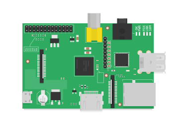
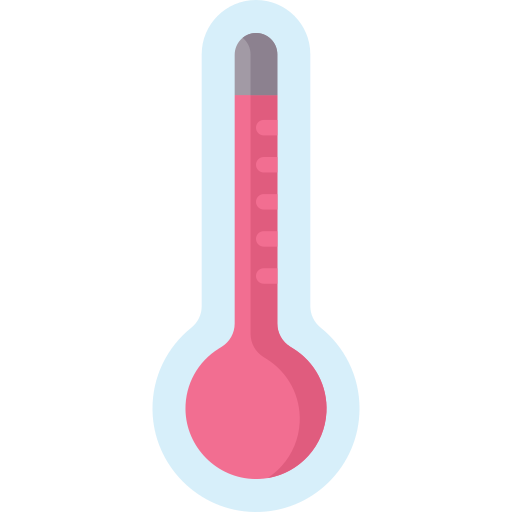
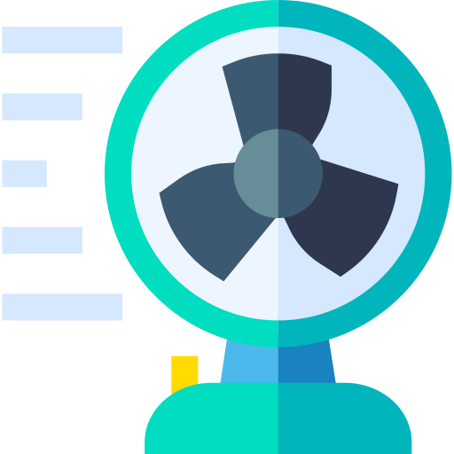

<!-- PROJECT SHIELDS -->
<!--
*** I'm using markdown "reference style" links for readability.
*** Reference links are enclosed in brackets [ ] instead of parentheses ( ).
*** See the bottom of this document for the declaration of the reference variables
*** for contributors-url, forks-url, etc. This is an optional, concise syntax you may use.
*** https://www.markdownguide.org/basic-syntax/#reference-style-links
-->

<!-- [![Contributors][contributors-shield]][contributors-url]
[![Forks][forks-shield]][forks-url]
[![Stargazers][stars-shield]][stars-url] -->
[![Issues][issues-shield]][issues-url]
[![MIT License][license-shield]][license-url]
[![Code Style][code-style-shield]][code-style-url]
[![LinkedIn][linkedin-shield]][linkedin-url]

<!-- PROJECT LOGO -->
 

  

  <h3 align="center">Azure IoT Hub Demo</h3>

  

    IoT application on Azure to connect a <b>RaspberryPi</b> to <b>IoT Hub</b>.  Sends device-to-cloud telemetry and allows cloud-to-device callbacks to be sent to the Raspberry Pi.
     
     
    
     
     
    <a href="https://github.com/sandervandorsten/azure-iothub-demo/issues">Report Bug</a>
    ·
    <a href="https://github.com/sandervandorsten/azure-iothub-demo/issues">Request Feature</a>
  

<!-- TABLE OF CONTENTS -->
## Table of Contents

* [About the Project](#about-the-project)
  * [Background](#background)
  * [Infrastructure](#infrastructure)
  * [Control Flow](#control-flow)
* [Getting Started](#getting-started)
  * [Prerequisites](#prerequisites)
  * [Deploying Infrastructure](#deploying-infrastructure)
  * [Starting Services](#starting-services)
    * [Registering Device on IoT Hub](#registering-device-on-iot-hub)
    * [Starting Data Analysis job on Stream Analytics](#starting-data-analysis-job-on-stream-analytics)
    * [Deploying function to Azure Functions](#deploying-function-to-azure-functions)
* [Usage](#usage)
* [License](#license)
* [Contact](#contact)
* [Resources used for project development](#Resources-used-for-project-development)

<!-- ABOUT THE PROJECT -->
## About The Project
serves as purpose for demoing cloud connectivity.

### Background
I started this project whilst working from home on different coding projects on Azure in the summer during the COVID-19 outbreak. Whilst working from home certainly has it's advantages, I did miss the AC that we have at the office at times. 

 

Whilst the temperature in my home-office sky-rocketed in June, I bought a ventilator to keep me cool. This was great, however having it turned on at all times is a bit of an overkill as it is certainly not hot all day-everyday here in the Netherlands. My ventilator however did not support temperature-based-control, hence I wanted to build this myself.

 

I had a Raspberry Pi lying around so wanted to use this as an interface for measuring temperature and controlling the ventilator. As I was working on a number of projects in Azure, I wondered if I could use their cloud services to connect this raspberry Pi to the cloud. Hence I asked myself:

 

    <b>Can I connect a Raspberry Pi to IoT Hub to 1) to send device-to-cloud telemetry data and 2) trigger the ventilator on my desk with a cloud-to-device message?</b>

In my mind, the application should contain a few components:
- Raspberry Pi: 
    - stream temperature data from device to the cloud. 
    - listen to signal that triggers fan activation from the cloud. 
- 'Arbitrary cloud Services':
    - data should be stored somewhere
    - Once a certain temperature threshold has been exceded, a message should be returned to the Raspberry Pi to trigger the fan.

### Infrastructure
I ended up using the following azure Infrastructure in Azure:
- **Raspberry Pi** to connect sensor and fan to. This project also includes a simulated Raspberry Pi device that you can run on your computer. 
- **Azure IoT Hub**. Allows you to securely connect IoT devices to Azure cloud, from which you can further route messages to different services.
- **Stream Analytics**. Performs streaming data analysis on your IoT input data and forwards the data to specified services. 
- **Blob Storage**. Stores the Data for later inspection.
- **Service Bus Queue**. Queue used as input/trigger for Azure Functions. 
- **Functions**. Serverless function that is triggered by the aforementioned Service Bus Queue, and sends a message via IoT Hub to the Connected Raspberry Pi device. 

[![Azure IoT Hub Demo][image-overview]]

### Control Flow

1. A Raspberry Pi collects data from a connected temperature sensor. It streams this data to an IoT Hub. 
2. The IoTHub processess incoming and outgoing requests from/to connected IoT Devices. It has a `Messaging` Endpoint, from which Stream Analytics ingests the data for further processing.
3. Stream analytics writes all telemetry temperature data to a blob storage, and writes a subset of the temperatures to a Queue on the Service Bus. In this example, we send only the telemetry data `temperature > 29` to the Queue. 
4. When a new message is stored on the Queue, a function is triggered. 
5. The function app sends a message to the IoT hub that the fan of the connected Raspberry Pi should turn on. effectively in our example this means that the fan will turn on for a while if, and only if `temperature > 29`. 
6. The IoT Hub securely forwards the message to the Raspberry Pi to start the connected ventilator.  

<!-- GETTING STARTED -->
## Getting Started

To install the required cloud components simply press the button below to deploy to azure.  

### Prerequisites

TBA

### Deploying Infrastructure

### Starting Services

TBA

#### Registering Device on IoT Hub]
TBA

#### Starting Data Analysis job on Stream Analytics
TBA

#### Deploying function to Azure Functions
TBA

<!-- USAGE EXAMPLES -->
## Usage

Use this space to show useful examples of how a project can be used. Additional screenshots, code examples and demos work well in this space. You may also link to more resources.

_For more examples, please refer to the [Documentation](https://example.com)_

<!-- ROADMAP -->
<!-- ## Roadmap

See the [open issues](https://github.com/sandervandorsten/azure-iothub-demo/issues) for a list of proposed features (and known issues). -->

<!-- CONTACT -->
## Contact

Sander van Dorsten - [Github](https://github.com/sandervandorsten) - sandervandorsten [at] gmail [dot] com

Project Link: [https://github.com/sandervandorsten/azure-iothub-demo](https://github.com/sandervandorsten/azure-iothub-demo)

## Related resources

* [Introduction to building IoT Solutions with Microsoft Azure (YouTube)](https://www.youtube.com/watch?v=Pxj9fYgcwV0)
* [**Azure For Everyone** Tutorials by Adam Marczak (YouTube)](https://www.youtube.com/channel/UCdmEIMC3LBil4o0tjaTbj0w)

<!-- MARKDOWN LINKS & IMAGES -->
<!-- https://www.markdownguide.org/basic-syntax/#reference-style-links -->
[contributors-shield]: https://img.shields.io/github/contributors/sandervandorsten/azure-iothub-demo.svg?
[contributors-url]: https://github.com/sandervandorsten/azure-iothub-demo/graphs/contributors
[forks-shield]: https://img.shields.io/github/forks/sandervandorsten/azure-iothub-demo.svg?
[forks-url]: https://github.com/sandervandorsten/azure-iothub-demo/network/members
[stars-shield]: https://img.shields.io/github/stars/sandervandorsten/azure-iothub-demo.svg?
[stars-url]: https://github.com/sandervandorsten/azure-iothub-demo/stargazers
[issues-shield]: https://img.shields.io/github/issues/sandervandorsten/azure-iothub-demo.svg?
[issues-url]: https://github.com/sandervandorsten/azure-iothub-demo/issues
[license-shield]: https://img.shields.io/github/license/sandervandorsten/azure-iothub-demo.svg?
[license-url]: https://github.com/sandervandorsten/azure-iothub-demo/blob/master/LICENSE
[linkedin-shield]: https://img.shields.io/badge/-LinkedIn-black.svg?&logo=linkedin&colorB=555
[linkedin-url]: https://linkedin.com/in/sandervandorsten
[image-overview]: images/azure-iothub-demo.png
[image-back-end-simulation]: images/back-end-simulation.png
[image-functions]: images/functions.png
[code-style-shield]: https://img.shields.io/badge/code%20style-black-000000.svg
[code-style-url]: https://github.com/psf/black
