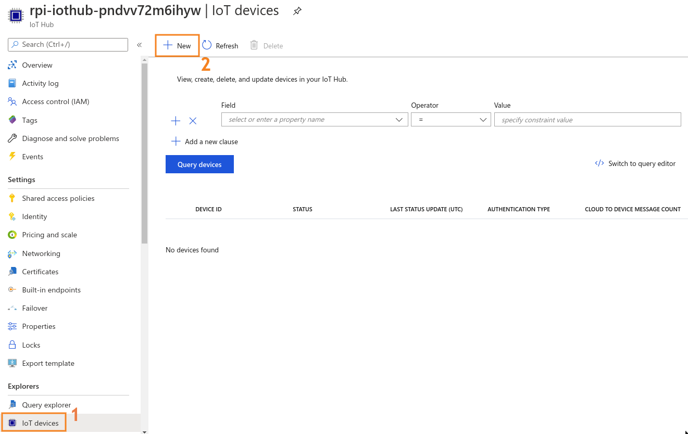

<!-- PROJECT SHIELDS -->
<!--
*** I'm using markdown "reference style" links for readability.
*** Reference links are enclosed in brackets [ ] instead of parentheses ( ).
*** See the bottom of this document for the declaration of the reference variables
*** for contributors-url, forks-url, etc. This is an optional, concise syntax you may use.
*** https://www.markdownguide.org/basic-syntax/#reference-style-links
-->

<!-- [![Contributors][contributors-shield]][contributors-url]
[![Forks][forks-shield]][forks-url]
[![Stargazers][stars-shield]][stars-url] -->
[![Issues][issues-shield]][issues-url]
[![Updates][pyup-shield]][pyup-url]
[![MIT License][license-shield]][license-url]
[![Code Style][code-style-shield]][code-style-url]
[![LinkedIn][linkedin-shield]][linkedin-url]


<!-- PROJECT LOGO -->
<br />
<p align="center">
  <a href="https://github.com/sandervandorsten/azure-iothub-demo">
    
  </a>

  <h3 align="center">Azure IoT Hub Demo</h3>

  <p align="center">
    IoT application on Azure to connect a <b>RaspberryPi</b> to <b>IoT Hub</b>. <br>Sends device-to-cloud telemetry and allows cloud-to-device callbacks to be sent to the Raspberry Pi.
    <br />
    <br>
    <a href="https://portal.azure.com/#create/Microsoft.Template/uri/https%3A%2F%2Fraw.githubusercontent.com%2Fsandervandorsten%2Fazure-iothub-demo%2Fmaster%2Finfra%2Fdeployment.json" target="_blank">
        
    </a>
    <br>
    <br />
    <a href="https://github.com/sandervandorsten/azure-iothub-demo/issues">Report Bug</a>
    ·
    <a href="https://github.com/sandervandorsten/azure-iothub-demo/issues">Request Feature</a>
  </p>
</p>

Do you want to have a fresh breeze in you home office, but are you to lazy to turn on the fan yourself? With this project you'll have your office cooled down in notime!


<!-- TABLE OF CONTENTS -->
## Table of Contents

* [About the Project](#about-the-project)
  * [Background](#background)
  * [Infrastructure](#infrastructure)
  * [Control Flow](#control-flow)
* [Getting Started](#getting-started)
  * [Prerequisites](#prerequisites)
  * [Deploying Infrastructure](#deploying-infrastructure)
  * [Starting Services](#starting-services)
    * [Registering a device on IoT Hub](#registering-a-device-on-iot-hub)
    * [Starting the analysis job on Stream Analytics](starting-the-analysis-job-on-stream-analytics)
    * [Deploying a function to Azure Functions](#deploying-a-function-to-azure-functions)
* [Usage](#usage)
* [License](#license)
* [Contact](#contact)
* [Resources used for project development](#Resources-used-for-project-development)


<!-- ABOUT THE PROJECT -->
## About The Project
This project helps you setup a relatively simple Azure Infrastructure for connecting your own Raspberry Pi to the cloud. You can use this as a starting point to develop small IoT applications. It contains:
- The possibility to simulate a Raspberry Pi from your computer to speed up development
- Simple data storage in a container for 'cold' analysis
- data flowing through Stream Analytics to perform live analysis and send this along to other Azure Services
- Infrastructure as code using ARM templates so you can deploy your own easily
  - Estimated costs: **< 10EUR / Month** (if you set IoT Hub to use a free account, limited to 1 per subscription)
- An easily extendable infrastructure, for example if:
  - You want to create a dashboard with PowerBI, you can [add PowerBI as an output to Stream Analytics](https://docs.microsoft.com/en-us/azure/stream-analytics/stream-analytics-power-bi-dashboard). 
  - You want to [register more IoT devices to IoT Hub](https://docs.microsoft.com/en-us/azure/iot-hub/iot-hub-get-started-physical) 

### Background
I started this project whilst working from home on different coding projects on Azure in the summer during the COVID-19 outbreak. Whilst working from home certainly has it's advantages, I did miss the AC that we have at the office at times. 

<br>


Whilst the temperature in my home-office sky-rocketed in June, I bought a ventilator to keep me cool. This was great, however having it turned on at all times is a bit of an overkill as it is certainly not hot all day-everyday here in the Netherlands. My ventilator however did not support temperature-based-control, hence I wanted to build this myself.

<br>


I had a Raspberry Pi lying around so wanted to use this as an interface for measuring temperature and controlling the ventilator. As I was working on a number of projects in Azure, I wondered if I could use their cloud services to connect this raspberry Pi to the cloud. Hence I asked myself:

<br>
<br>

<p align="center" style="font-size: 30px ; padding 0px 50px">
    <b>Can I connect a Raspberry Pi to IoT Hub to  <br> 1) send device-to-cloud telemetry data and <br> 2) trigger the ventilator on my desk with a cloud-to-device message?</b>
<p>

In my mind, the application should contain a few components:
- Raspberry Pi: 
    - stream temperature data from device to the cloud. 
    - listen to signal that triggers fan activation from the cloud. 
- 'arbitrary-cloud-services':
    - data should be stored somewhere
    - Once a certain temperature threshold has been exceded, a message should be returned to the Raspberry Pi to trigger the fan.


### Infrastructure
I ended up using the following Infrastructure:
- **Raspberry Pi** to connect sensor and fan to. This project also includes a simulated Raspberry Pi device that you can run on your computer to speed up development. 
- **Azure IoT Hub**. Allows you to securely connect IoT devices to Azure cloud, from which you can further route messages to different services.
- **Stream Analytics**. Performs streaming data analysis on your IoT input data and forwards the data to specified services. 
- **Blob Storage**. Cold storage for the data.
- **Service Bus Queue**. Queue used as input/trigger for Azure Functions. 
- **Functions**. Serverless function that is triggered by the aforementioned Service Bus Queue, and sends a message via IoT Hub to the Connected Raspberry Pi device. 


### Control Flow

1. A Raspberry Pi collects data from a connected temperature sensor. It sends this so-called telemetry data to it's designated IoT Hub. 
2. The IoT Hub processess incoming and outgoing requests from/to connected IoT devices. It has a `Messaging` Endpoint, from which Stream Analytics ingests the Raspberry Pi temperature telemetry for further processing.
3. Stream Analytics writes all telemetry temperature data to a blob storage, and writes a subset of the temperatures to a Queue on the Service Bus. In this example, we send only the telemetry data `temperature > 29` to the Queue. 
4. When a new message is stored on the Queue, a Azure Function is triggered. 
5. The function app sends a message to the IoT hub that the fan of the connected Raspberry Pi should turn on. Effectively in our example this means that the fan will turn on for a while if, and only if `temperature > 29`. 
6. The IoT Hub securely forwards the message to the Raspberry Pi to start the connected ventilator.


<!-- GETTING STARTED -->
## Getting Started

In this step-by-step guide we'll help you set up everything to get your own application up and running. The setup is going to cover the following parts: 
 1. [Deploying your own copy infrastructure to Azure using ARM templates](#deploying-infrastructure)
 2. [Starting and configuring the individual services](#starting-services), specifically:
    1. [Registering a (simulated) Raspberry Pi device on IoT Hub](#registering-a-device-on-iot-hub)
    2. [Starting our analysis job on Stream Analytics](#starting-the-analysis-job-on-stream-analytics)
    3. [Deploying a function to Azure Functions](#deploying-a-function-to-azure-functions)
 3. TBA

### Prerequisites

- Azure account with a subscription you are allowed to create resources in (Free Trial Subscription should do)
- ...

### Deploying Infrastructure
I've [defined the infrastructure in an ARM template](https://azure.microsoft.com/en-us/resources/templates/). This allows you to press the button below and deploy the infrastructure to your own Azure account with the click of a button. 

[](https://portal.azure.com/#create/Microsoft.Template/uri/https%3A%2F%2Fraw.githubusercontent.com%2Fsandervandorsten%2Fazure-iothub-demo%2Fmaster%2Finfra%2Fdeployment.json)

1. Press the 'Deploy to Azure' button above to create a custom deployment in Azure
2. Login to your Azure Account where you want to create the application (if not logged in yet)
3. You should then see the Custom Deployment screen as in the screenshot below. Here you can specify some settings for the Deployment.
    1. Select a subscription in which you want to create the resources in
    2. Create a new resourcegroup in which you want to deploy these resources
    3. Keep all the other settings as default, unless you know what you're doing and want to change something
    4. Scroll down, accept the terms and conditions and click Purchase.
    5. **IMPORTANT** Remember that this deployment and the running of it will cost you money. For me, I didn't pay more that a few euros and I let it run for a month or so. Please remember to remove your resources if you're not using them anymore! 
4. After a couple of minutes (+- 5 minutes I guess) your infrastructure deployment should be completed. Navigate to the resource group you've created to see the different services you've deployed. 


### Starting Services
You should now have the individual components deployed within your Resource Group. Navigate to your resource group overview, and you'll see something like this.


To use our end-to-end application, we must activate and configure some of our individual services. We're going to do that now.  

#### Registering a device on IoT Hub
The Azure IoT Hub is a managed service, hosted in the cloud, that acts as a central message hub for bi-directional communication between your IoT application and the devices it manages. You can use Azure IoT Hub to build IoT solutions with reliable and secure communications between millions of IoT devices and a cloud-hosted solution backend. You can connect virtually any device to IoT Hub. Today we're going to connect only one device.

To register a device on IoT Hub:
1. Go to your IoT Hub resource and select the menu blade **IoT Devices** (see screenshot below)
2. Register a New device by clicking **+ New**
3. In the "Create a Device" tab, **write down a Device ID**, for example `MyRaspberryPi`. This should be a identifier unique within the IoT Hub.
4. Leave everything else to it's default values and press **Save**. 
5. **You have succesfully registered a device on IoT Hub**! You will come back to this screen later to **copy the (Primary) Connection String to your local configuration file (your `.env` file)** to allow your device to connect to IoT Hub. We will do this later though, once we're doing configuring the infrastructure.



#### Starting the analysis job on Stream Analytics
Azure Stream Analytics is a real-time analytics and complex event-processing engine that is designed to analyze and process high volumes of fast streaming data from multiple sources simultaneously. Patterns can be identified from a number of input sources including devices, sensors and applications. These patterns can be used to trigger actions and initiate workflows such as creating alerts, feeding information to a reporting tool, or storing transformed data for later use. 

We will use Stream Analytics to ingest data from IoT Hub and move it to both Blob Storage and a Service Bus Queue for more complex actions. This is already configured for you when the infrastructure was deployed, the only thing we need to do is **Start the Streaming Job**.

1. **Navigate to your Stream Analytics resource** and you will see the the **Overview page**. 
2. On the bottom right you will see the **Query that is already pre-defined**. This query does 2 things. (it shown below as well for convenience)
    1. it moves all data from the **input called `iothub` to the output called `blobstorage`**
    2. it moves all data where `temperature > 29` from the **input called `iothub` to the output called `servicebus`**
    ```SQL 
    SELECT
        *
    INTO
        blobstorage
    FROM
        iothub

    SELECT
        *
    INTO
        servicebus
    FROM
        iothub
    WHERE
        temperature > 29
    ```
3. If you want to learn how this input and outputs are actually coupled to the IoT Hub and Service Bus in our infrastructure, you can navigate to the menu blades on the left of your screen called **inputs** and **outputs** (under **Job Topology**). At deployment time, the bindings to these services were already done for you so you don't have to worry about them. If you want to learn how to create these yourself, **I recommend [This video](https://www.youtube.com/watch?v=NbGmyjgY0pU) by Adam Marczak** on Azure Stream Analytics. I fact, I recommend all his Azure tutorials, which helped me a great deal in developing this project.
4. Now you know roughly what happens in Stream Analytics, we can activate this Stream Analytics Job to start processing incoming requests. Remember that we haven't connected any devices yet, but we're just preconfiguring the infrastrature. Press the **> Start** button **at the top of the Overview** menu to start the job. It takes about a minute or two to activate, you can see the status straight below it. (see screenshot below)
5. You have sucessfully started your Steam Analytics job! In a bit, our Raspberry Pi Data will flow through this job to the connected services. Now it's not doing anything yet though, So lets quickly finish up our infrastructure setup to start sending data. 


<p align="center">
  
</p>

#### Deploying a function to Azure Functions
TBA

<!-- USAGE EXAMPLES -->
## Usage

Use this space to show useful examples of how a project can be used. Additional screenshots, code examples and demos work well in this space. You may also link to more resources.

_For more examples, please refer to the [Documentation](https://example.com)_


<!-- ROADMAP -->
<!-- ## Roadmap

See the [open issues](https://github.com/sandervandorsten/azure-iothub-demo/issues) for a list of proposed features (and known issues). -->


<!-- CONTACT -->
## Contact

Sander van Dorsten - [Github](https://github.com/sandervandorsten) - sandervandorsten [at] gmail [dot] com

Project Link: [https://github.com/sandervandorsten/azure-iothub-demo](https://github.com/sandervandorsten/azure-iothub-demo)


## Related resources

* [Introduction to building IoT Solutions with Microsoft Azure (YouTube)](https://www.youtube.com/watch?v=Pxj9fYgcwV0)
* [**Azure For Everyone** Tutorials by Adam Marczak (YouTube)](https://www.youtube.com/channel/UCdmEIMC3LBil4o0tjaTbj0w)


<!-- MARKDOWN LINKS & IMAGES -->
<!-- https://www.markdownguide.org/basic-syntax/#reference-style-links -->
[contributors-shield]: https://img.shields.io/github/contributors/sandervandorsten/azure-iothub-demo.svg?
[contributors-url]: https://github.com/sandervandorsten/azure-iothub-demo/graphs/contributors
[forks-shield]: https://img.shields.io/github/forks/sandervandorsten/azure-iothub-demo.svg?
[forks-url]: https://github.com/sandervandorsten/azure-iothub-demo/network/members
[stars-shield]: https://img.shields.io/github/stars/sandervandorsten/azure-iothub-demo.svg?
[stars-url]: https://github.com/sandervandorsten/azure-iothub-demo/stargazers
[issues-shield]: https://img.shields.io/github/issues/sandervandorsten/azure-iothub-demo.svg?
[issues-url]: https://github.com/sandervandorsten/azure-iothub-demo/issues
[license-shield]: https://img.shields.io/github/license/sandervandorsten/azure-iothub-demo.svg?
[license-url]: https://github.com/sandervandorsten/azure-iothub-demo/blob/master/LICENSE
[linkedin-shield]: https://img.shields.io/badge/-LinkedIn-black.svg?&logo=linkedin&colorB=555
[linkedin-url]: https://linkedin.com/in/sandervandorsten
[code-style-shield]: https://img.shields.io/badge/code%20style-black-000000.svg
[code-style-url]: https://github.com/psf/black
[pyup-shield]: https://pyup.io/repos/github/sandervandorsten/azure-iothub-demo/shield.svg
[pyup-url]: https://pyup.io/repos/github/sandervandorsten/azure-iothub-demo/


[image-overview]: images/azure-iothub-demo.png
[image-back-end-simulation]: images/back-end-simulation.png
[image-functions]: images/functions.png
[image-deployment01]: images/deploying_infrastructure01.png
[image-deployment02]: images/deploying_infrastructure02.png
